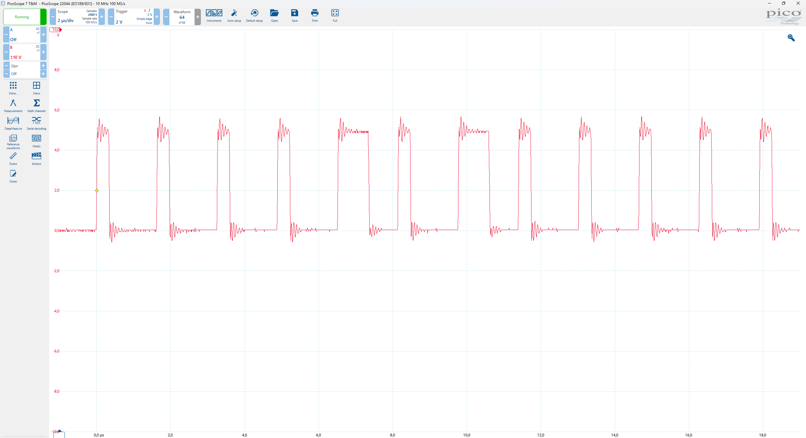

Neopixel (5050 RGB LED) driver for RC2014

Documentation for a once-of project for the RC2014 computer: Driving NeoPixels on a neopixel ring. https://www.kiwi-electronics.com/nl/1-4-60-neopixel-ring-15-x-5050-rgb-led-met-geintegreerde-drivers-2786. Based on the knowledge of https://wp.josh.com/2014/05/13/ws2812-neopixels-are-not-so-finicky-once-you-get-to-know-them/. I know, there is a module for that, https://z80kits.com/shop/neopixel-module-short-board/, but i figured i can make it myself.

The circuit is mostly proto board, there is no full schematic PDF. Pictures for future reference.

The ICs are: 
- 74hct688 byte comparator for address
- 74hct32 4 or ports
- 74hct04 6 inverters
The RC circuit uses 100 kOhm and 22 pF

